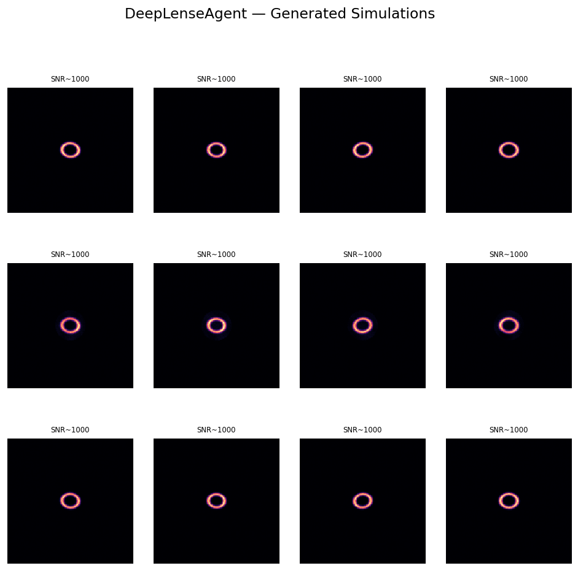
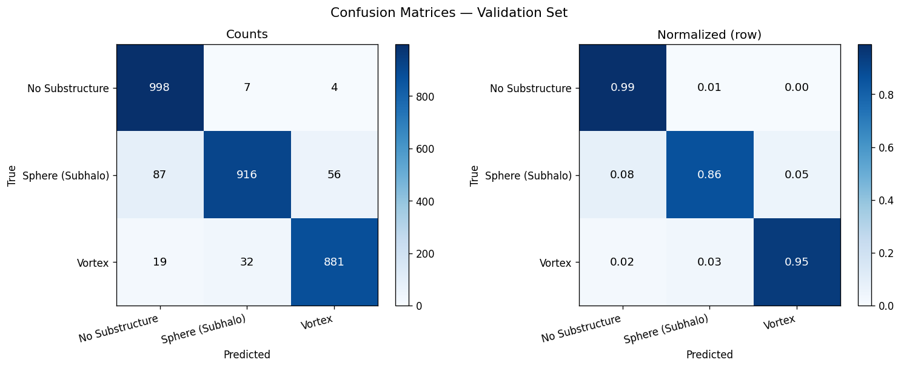

# DeepLenseAgent — GSoC 2026 Submission
### ML4SCI · DeepLense Project (DEEPLENSE1)
**Applicant:** Ibrahim Nagy Abd Elrazek Elsaid Emara · [`github.com/hima-84`](https://github.com/hima-84)

---

## Overview

This repository contains my complete submission for the Google Summer of Code 2026
**ML4SCI / DeepLense** project: *"Agentic AI for Gravitational Lensing"*.

It covers both required evaluation tests:

| Test | Description | Key Result |
|------|-------------|------------|
| **Common Test I** | Multi-class strong lensing classification | Mean AUC **0.9895** |
| **Specific Test II** | Agentic AI pipeline wrapping DeepLenseSim | Full HITL agent with Pydantic + Gemini |

---

## Repository Structure

```
DeepLense-GSoC2026/
├── Common_Test_I/
│   ├── DeepLense_GSoC2026_CommonTest_Classification_v3.ipynb
│   └── requirements.txt
├── Specific_Test_II/
│   ├── DeepLense_GSoC2026_TestII_AgenticAI_FIXED.ipynb
│   └── requirements.txt
├── outputs/
│   ├── roc_curve.png
│   ├── confusion_matrix.png
│   └── agent_simulation_grid.png
├── proposal/
│   └── GSoC2026_DeepLenseAgent_Proposal.pdf
└── README.md
```

---

## Common Test I — Gravitational Lensing Classification

### Task
Classify strong gravitational lensing images into three dark matter substructure classes:
- `no_substructure` — smooth SIE halo, symmetric Einstein ring
- `sphere` (CDM subhalo) — cold dark matter clumps, flux-ratio anomalies
- `vort` (axion vortex) — fuzzy/axion DM interference fringes, astrometric perturbations

### Architecture
**EfficientNet-B0** (ImageNet pretrained, adapted for single-channel grayscale input).
The RGB first-layer weights are averaged into a single channel, preserving learned
low-level spatial detectors while adapting to physics images.

### Results

| Class | Precision | Recall | F1 | AUC |
|-------|-----------|--------|-----|-----|
| No Substructure | 0.904 | 0.989 | 0.945 | **0.9913** |
| Sphere (CDM) | 0.959 | 0.865 | 0.910 | **0.9824** |
| Vortex (Axion) | 0.936 | 0.945 | 0.941 | **0.9948** |
| **Mean** | **0.933** | **0.933** | **0.932** | **0.9895** |

Validation set: 3,000 samples (90/10 stratified split). Validation accuracy: **93.17%**.

### Training Setup
- Optimizer: AdamW + Cosine Annealing LR scheduler
- Batch size: 64 · Epochs: 20 · Mixed-precision (AMP)
- Augmentation: RandomHorizontalFlip, RandomVerticalFlip, RandomRotation(180°)
- Hardware: NVIDIA Quadro P2000 (4.3 GB VRAM)

### Pre-trained Model Weights
The best checkpoint (`best_efficientnet_b0.pth`) is available on Google Drive:
>
 **[Download best_efficientnet_b0.pth](https://drive.google.com/file/d/1nOADHBdIG1lkcyDDg7Z2RlOgNm4Z7z9z/view?usp=sharing)**
>

To load:
```python
import timm, torch
model = timm.create_model('efficientnet_b0', pretrained=False, num_classes=3)
# adapt first conv for grayscale (see notebook for full build_efficientnet_b0())
model.load_state_dict(torch.load('best_efficientnet_b0.pth', map_location='cpu'))
model.eval()
```

### How to Run
1. **[Download Official DeepLense Dataset (Google Drive)](https://drive.google.com/file/d/1ZEyNMEO43u3qhJAwJeBZxFBEYc_pVYZQ/view)**
2. Set `DATA_ROOT` and `SAVE_DIR` in the Configuration cell
3. Run all cells top to bottom

---

## Specific Test II — Agentic AI Pipeline

### Task
Build an agentic workflow using **Pydantic AI** that wraps the DeepLenseSim simulation
pipeline, accepting natural language prompts and generating strong gravitational lensing
images with structured metadata.

### Architecture

```
User NL Prompt
      │
      ▼
┌─────────────────────────────────────┐
│   DeepLenseAgent (Pydantic AI)      │  ← Gemini 2.0 Flash backend
│   • Intent parsing (regex + LLM)    │
│   • HITL clarification questions    │
│   • Pydantic GR validation          │
│   • 6 registered tool functions     │
└──────────────┬──────────────────────┘
               │
        ┌──────┴──────┐
        ▼             ▼
  lenstronomy     Mock SIE Engine
  (full physics)  (numpy only)
        │             │
        └──────┬──────┘
               ▼
    SimulationResult + 13-field JSON metadata
```

### Key Features
- **Natural language interface**: *"Give me 6 Euclid-like CDM images at z_lens=0.4"*
- **Physics enforcement**: Pydantic `@model_validator` rejects `z_source ≤ z_lens` before execution
- **Human-in-the-loop**: Agent surfaces targeted clarification questions for ambiguous parameters
- **Dual-backend router**: Automatically falls back to mock SIE engine if lenstronomy unavailable
- **13-field metadata**: Every `.npy` image bound to a JSON record for full reproducibility
- **Supports Model_I and Model_II** (Euclid-like) instrument configurations

### Supported Substructure Types
| Class | Physics | Agent Config |
|-------|---------|-------------|
| `no_substructure` | Smooth SIE halo | Any model |
| `cdm_subhalo` | Point-mass NFW subhalos | Model_I / III / IV |
| `axion_vortex` | Quantum vortex filaments | Model_II |

### How to Run

**Requirements:**
```bash
pip install pydantic-ai[gemini] pydantic>=2.5 numpy matplotlib scipy
# Optional for full physics:
pip install lenstronomy pyHalo
```

**Set your Gemini API key:**
```bash
export GEMINI_API_KEY=your_key_here
```

**Run the notebook** and interact with the agent:
```python
agent = DeepLenseConversation()
result = agent.chat("Generate 5 CDM lensing images using Model_II")
# Agent asks clarifying questions, then runs simulation
```

---

## Generated Outputs

### Agent Simulation Grid (SNR ≈ 1000)


*12 strong lensing images generated from a single natural-language prompt.
Clean-room (SNR ≈ 1000) data suitable for curriculum learning.*

### ROC Curves — EfficientNet-B0


### Confusion Matrices


---

## Proposal

The full technical proposal (PDF) is in [`proposal/GSoC2026_DeepLenseAgent_Proposal.pdf`](proposal/GSoC2026_DeepLenseAgent_Proposal.pdf).

It covers:
- Astrophysical background (SIE lens model, FDM vortex theory)
- Full classification results and analysis
- Agent architecture and Pydantic schema design
- Technical challenges and engineering mitigations
- GSoC 2026 week-by-week timeline

---

## Environment

| Dependency | Version |
|-----------|---------|
| Python | 3.12.10 |
| PyTorch | 2.6.0+cu124 |
| timm | 1.0.26 |
| pydantic-ai | 1.73.0 |
| pydantic | 2.12.5 |
| numpy | ≥1.24 |
| scikit-learn | ≥1.3 |

---

## Contact

**Ibrahim Nagy Abd Elrazek Elsaid Emara**
GitHub: [github.com/hima-84](https://github.com/hima-84)
